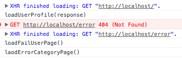

# test-event-handling-mistake

> :ledger: Example of problem with bad error management

## Screenshot



## How tu run code?

In two ways:

1. Node.js

```
node index.js
```

2. Browser

Open `demo/index.html` in Google Chrome.

## Code

One [file](./index.js) with bad construction.

## License 

[The MIT License](http://piecioshka.mit-license.org) 2016 @ Piotr Kowalski
