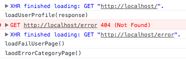

# test-event-handling-mistake

📒 Test app with a problem with bad error management

## Screenshot



## How tu run code?

In two ways:

* Terminal (use Node.js)

    ```
    $ node index.js
    ```

* Browser

    Open `demo/index.html` in Google Chrome.

## Code

[File](./index.js) with mistake.

## License 

[The MIT License](https://piecioshka.mit-license.org) @ 2026
